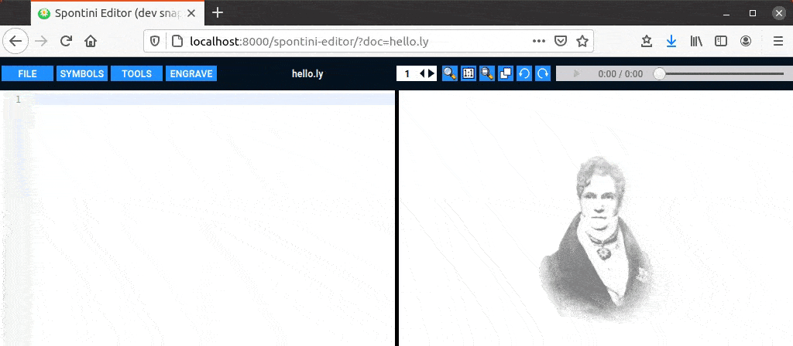

<p align="center">
    
</p>
<h3 align="center">An advanced GUI assistant for Lilypond</h3>
<p align="center"><i>Complex music engraving made possible and fast</i></p>
<br/>

Spontini-Editor is a text-combined-with-graphic music editor that strongly speeds up the creation and fine graphic tuning of complex scores edited with **[Lilypond](https://lilypond.org)** through two main features:

  * It allows the positioning of musical objects (articulations, texts, pedals, curves, brackets etc.) with the mouse, both for "avoid-collisions" properties (X/Y-offset, staff-padding, outside-staff-padding, padding) and for extra-offset property. Once the positioning is graphically done, the text editor reports the corresponding changes on the input file: these changes are written in standard Lilypond code and do not require any additional software to be compiled.

  * It assists in the creation of piano music by inserting notes in tabular and formatted form. It also supports cross-staff scores through a set of work-arounds (invisible to the user) that solve many issues of the native cross-staff functions.

Other main features:

  * Multi-platform (written in Javascript and Python 3)
  * Web server + client GUI architecture: the client runs, without any installation, on the main browsers (currently tested on: Chrome, Chromium, Firefox, Brave), thus allowing to edit Lilypond documents with cheap and small boards, like **[Raspberry PI](https://www.raspberrypi.org/)**.
  * The application server is made with a main layer which runs on the main Python *ASGI* platforms, like **[Uvicorn](https://www.uvicorn.org/)**, **[Daphne](https://github.com/django/daphne)** etc; it supports both **SSL** and **Tor** for security, and all the features provided by the Python ASGI servers.
  * Plugin engine that can interface to **any** library/utility suitable for Lilypond; implemented plugins currently support: **[Abjad](https://github.com/Abjad/abjad)**, **[python-ly](https://github.com/frescobaldi/python-ly)**, **[musicxml2ly](https://lilypond.org/doc/v2.21/Documentation/usage/invoking-musicxml2ly)** and **[VLC](https://www.videolan.org/vlc/index.html)**; plugins can be created as well by the users through a XML API (which interfaces to external scripts).
  * Python 3 scripting interface
  * A *pure HTML midi player* is included (**[Magenta](https://github.com/magenta/magenta)** through **[html-midi-player](https://github.com/cifkao/html-midi-player)**, ready to be used on the browser).
  * Pan-zoom advanced interface.
  * Multiple layouts.
  * "Fork-mode" for **collaborative** remote editing.
  * Code completion
  * Quick insert for a set of notation symbols.
  * Self-installable in embedded environment (venv).

*Note that Spontini-Editor is **NOT** a **WYSIWYG** notation editor (like Finale, Sibelius etc.). It only uses the graphical interface to avoid the waste of time caused by Lilypond functions that require the trial-and-error process. All the functions that do not require this process have been intentionally left to be implemented with the only text editor, in pure Lilypond language, which must therefore be known in advance by the user: through the knowledge of this language, and adding the Spontini-Editor functions to it, you can get a much faster editing process than WYSIWYG editors. In addition, as can be seen in the documentation below, the conversion of the Spontini-Editor functions into native Lilypond code can be obtained by changing simple strings in the corresponding musical expressions.*

Spontini-Editor's text editor component uses **[Codemirror](https://codemirror.net/)** library, which it will automatically download from the [cloud](https://cdnjs.cloudflare.com).

Thanks to [Aaron Hill](https://github.com/seraku24), Thomas Morley, Martin Tarenskeen and all the #regex irc channel (freenode) for the support in doing this!

## 

<br></br><br></br>
## INSTALLATION

* **All platforms**

    Just install (use the default installation settings!):

    **1) [Lilypond 2.19.84 or newer](http://lilypond.org/download.html)** (tested with 2.19.84 and 2.20.0).

    **2) [Python 3.6 or newer](https://www.python.org/downloads/).**

* **Debian based distros**

    ``` sudo apt install python3 python3-tk python3-pip python3-venv ```
<br></br><br></br>
## QUICK START

  * Copy the Spontini-Editor directory wherever you want, run **SpontiniServer.py** with Python 3 and wait until the setup has been completed.

    **NOTE** for **Windows** users: *you can launch SpontiniServer by simply double-clicking on SpontiniServer-WIN.vbs (or SpontiniServer-WIN.bat).*

  * Open the page: *http://localhost:8000/spontini-editor* with your browser. The editor will appear and it will allow to edit and compile files in the default workspace, which is the "examples" directory of the project.

  * You can check the Lilypond compiling output on the Javascript console of your browser (open "Web developer" ---> "Web console" on Firefox and "More tools" ---> "Developer tools" on Chrome/Chromium).

  * **IMPORTANT NOTE!** *Keep ALL the files in the main directory at their place, otherwise SpontiniServer.py won't work*.
<br></br><br></br>
## [GO TO THE DOCUMENTATION](documentation/toc.md)
