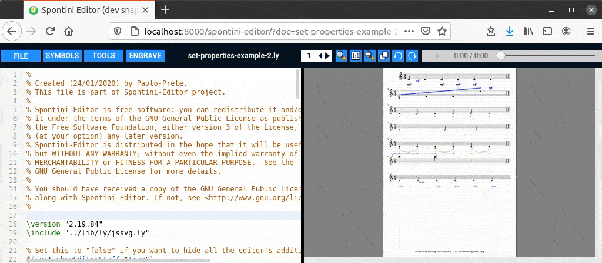

<!--
Created (20/11/2020) by Paolo-Prete.
This file is part of Spontini-Editor project.

Spontini-Editor is free software: you can redistribute it and/or modify
it under the terms of the GNU General Public License as published by
the Free Software Foundation, either version 3 of the License, or
(at your option) any later version.
Spontini-Editor is distributed in the hope that it will be useful,
but WITHOUT ANY WARRANTY; without even the implied warranty of
MERCHANTABILITY or FITNESS FOR A PARTICULAR PURPOSE.  See the
GNU General Public License for more details.

You should have received a copy of the GNU General Public License
along with Spontini-Editor. If not, see <http://www.gnu.org/licenses/>.
-->

# Tweaking/Overriding music properties
<br></br>



<br></br>

Spontini-Editor maps LilyPond's **\once \override** and **\tweak** commands, used on object positioning properties (**extra-offset**, **Y-offset** etc.), with two respective commands: **\jsOnceOverride** and **\jsTweak**. The result of these commands can be modified using the mouse, acting on the generated SVG drawing, in order to avoid LilyPond's standard trial-and-error process.

For example, if we want to modify the extra-offset of a dynamic, the standard LilyPond code will be:

```
{
    % LilyPond standard
    %
    % Tweak
    c' c' \tweak extra-offset #'(0.71 . -3.539) \mf c' c'
    % Override
    c' \once \override DynamicText.extra-offset = #'(1.806 . -2.388) c'\mf c' c'
}
```
The above code, translated into the respective Spontini-Editor commands, becomes:

```
\include "path/to/lib/ly/jssvg.ly"

{
    % Spontini-Editor's map
    %
    % Tweak
    c' c' \jsTweak "ID1" "extra-offset" #'(0.71 . -3.539) \mf c' c'
    % Override
    c' \jsOnceOverride "ID2" "extra-offset" #'(1.806 . -2.388) DynamicText c'\mf c' c'
}
```

Where "ID1/2" are unique numbers associated with each of the properties to be modified. The **\jsTweak** and **\jsOnceOverride** commands (and, consequently, the unique IDs) can be automatically generated in three ways:

 1. By clicking on the corresponding dynamic in the right display panel of the score with the right mouse button; a drop-down menu will open: it allows you to choose the property to be modified.

 2. By pressing **Ctrl-F1** (\jsTweak) and **Ctrl-F2** (\jsOnceOverride) keys. A string in the form **\jsTweak(Override) "ID" " " # '()** will be generated by the editor; in this string, the property to be modified must be entered manually.
 
 3. By Choosing \jsTweak or \jsOnceOverride in the TOOLS menu (same as 2. )

Once the Spontini-Editor commands have been created, and after compiling the file, the corresponding objects will be highlighted by the editor and you can edit them with the mouse.

Try **[THIS](../examples/set-properties-example-1.ly)** and **[THIS](../examples/set-properties-example-2.ly)** example to better understand.

*NOTE 1*: For **beams** and **curves** (Slur, PhrasingSlur and Tie) the respective commands to be used are **\jsOnceOffset** and **\jsShape**, available in the drop-down menu, which map respectively **\once \offset** and **\shape** commands. Refer to **[THIS](../examples/set-properties-example-2.ly)** so to see how they must be set

*NOTE 2*: For a (non-exhaustive) list of the properties supported by Spontini-Editor for the various objects, refer to **[THIS](../examples/set-properties-example-2.ly)** and **[THIS](../examples/padding-on-brackets-example.ly)** examples (being updated).

### [TABLE OF CONTENTS](toc.md)
